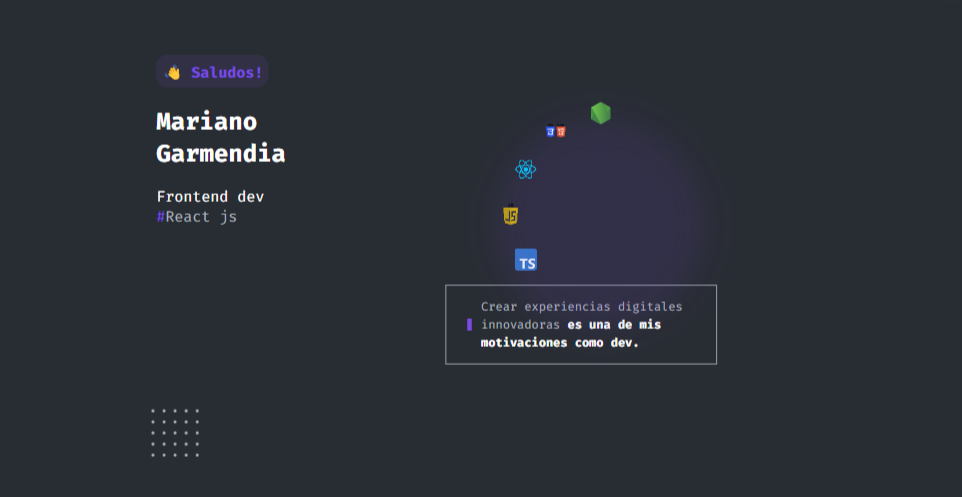

### Hola!  |  Hi there!👋

 

#

- 👨‍💻 Actualmente me encuentro creando proyectos personales con uso en la vida real, podras visitar mi portfolio para conocerlos
- 📚 Aprendiendo tecnologias frontend y backend para formarme como Fullstack
- 💪🏼 Futuros objetivos: Formar parte de un equipo donde aportar mi valor, creatividad, conocimientos y sobre todo energia y pasion por la programacion.

---

##### Lenguajes y tecnologías que uso

![Firestore]https://img.shields.io/badge/Firebase-039BE5?style=for-the-badge&logo=Firebase&logoColor=white

##### Lo que estoy aprendiendo actualmente

---

> Gracias por visitar mi perfil 👌

✅🆙💬 Contactemos 
>

